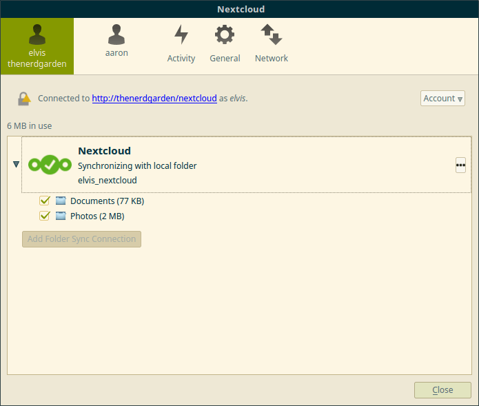

# How To Compile NextCloud Client For Linux
****
## Compile Guilde for Ubuntu 16.04 and LinuxMint 18

Currently there is no pre-built binaries for the NextCloud client for Linux.

I've put together this guide based on the NextCloud source README.md but had to track down various fixes and tweaks to successfully compile and install it for LinuxMint 18.
I used this guide to compile my own copy of the NextCloud client for Linux.
Feel free to use this guide to compile your own. Enjoy!

The original blog post is located here: [TheNerdGarden](https://www.thenerdgarden.com/how-to-compile-nextcloud-client-for-linux/)
****
## Installing Dependencies

1. We will need git to sync the source code and cmake to set up the build environment.
2. Open a terminal window and use the code below to install those using these commands.

```bash
sudo apt-get install git cmake
```
## Update the qtkeychain Libraries

1. The qtkeychain-dev and qt5keychain-dev libraries need to be at least version 0.7.0.
2. On Ubuntu these librarys will need updated.
3. We’ll use a PPA with the updated libraries. Thanks Filip Dorosz for making these libraries available!
4. In your terminal window, we will install the PPA using the code below:
```bash
sudo add-apt-repository ppa:fihufil/test-02
sudo apt-get update
```
5. Install the updated libraries
```bash
sudo apt-get install qtkeychain-dev qt5keychain-dev
```
## Install NextCloud Client Dependencies

NextCloud is a fork of OwnCloud and the Desktop client we are compiling actually pulls in source code from OwnCloud.

We will need to add the OwnCloud code repository using these commands:

```bash
sudo sh -c "echo 'deb-src http://download.opensuse.org/repositories/isv:/ownCloud:/desktop/Ubuntu_16.04/ /' >> /etc/apt/sources.list.d/owncloud-client.list"
sudo apt-get update
sudo apt-get build-dep owncloud-client
```
## Download the NextCloud Source Code From Github

The code is located at: https://github.com/nextcloud/client_theming

```bash
git clone https://github.com/nextcloud/client_theming.git
cd client_theming
git submodule update --init --recursive
```
## Compile and Install

1. In a terminal window, enter the following code:
```bash
 mkdir build-linux
 cd build-linux
 cmake -D OEM_THEME_DIR=`pwd`/../nextcloudtheme ../client
 make
 sudo make install
```
2. Update the system PATH to include our newly compiled libraries. The NextCloud client will be installed to /usr/local/bin/ which is all well and good, but the libraries are actually installed to /usr/local/lib/x86_64-linux-gnu
On ubuntu this location is not in the path by default. We need to add it.
```bash
sudo nano /etc/ld.so.conf.d/x86_64-linux-gnu.conf
```
3. Add this line at the end:
/usr/local/lib/x86_64-linux-gnu
4. Apply that change by running:
```bash
sudo ldconfig
```
5. Run the client
```bash
alt + f2
 nextcloud
```



****
## Credits
* https://launchpad.net/~fihufil/+archive/ubuntu/test-02
* https://github.com/nextcloud/client_theming/blob/master/README.md
